# Charlas de Backend

## Interfaces Gráficas en Java Swing

### Tabla de contenidos

- [¿Cómo empezar?](#¿cómo-empezar)
  - [Eclipse + WindowBuilder](#eclipse--windowbuilder)
  - [Netbeans](#netbeans)
  - [IntelliJ + GUI Designer](#intellij--gui-designer)
  - [Visual Studio Code](#visual-studio-code)
- [¿Cómo exportar como .jar ejecutable?](#¿cómo-exportar-jar-ejecutable-del-proyecto)
  - [Eclipse](#eclipse)
  - [Netbeans](#netbeans-1)
  - [IntelliJ](#intellij)
  - [Visual Studio Code](#visual-studio-code)
- [Recursos Adicionales](#recursos-adicionales)

### ¿Cómo empezar?

#### Eclipse + WindowBuilder

Para usar el plugin WindowBuilder de Eclipse es necesario instalarlo. El artículo
[Interfaces Gráficas con Eclipse WindowBuilder](https://www.aluracursos.com/blog/interfaces-graficas-con-eclipse-windowbuilder) de Alura Latam muestra una guía de instalación y uso.

#### Netbeans

Netbeans viene con una herramienta similar al WindowBuilder integrada por defecto, lista para usar.

Para crear una vista en un nuevo proyecto:

1. Crear un JFrame:

- Hacer click derecho sobre el paquete donde se va a crear:
- Escoger `New` -> `JFrame Form` en el menú:
  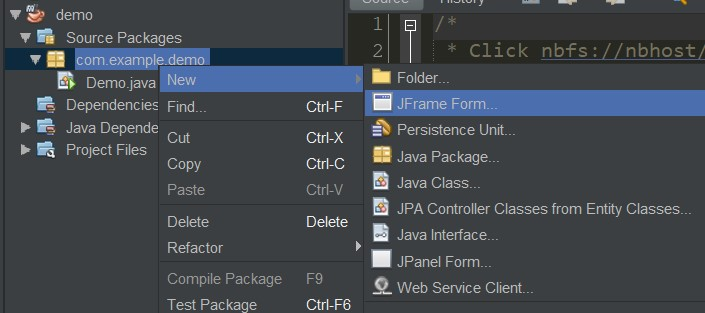

2. Automáticamente se abre el editor de Netbeans, en el cual podremos diseñar la interfaz arrastrando y soltando componentes de la paleta en el JFrame:
   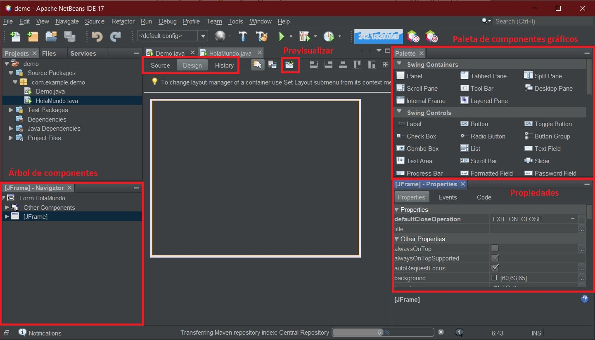
   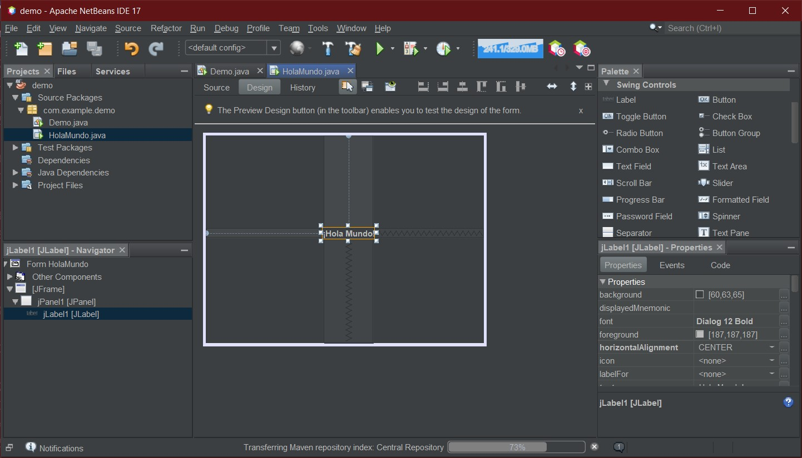
3. El código correspondiente a dicho diseño se genera de forma automática y puede editarse desde la vista "Source".

- Por defecto, Netbeans genera a los JFrames como clases ejecutables (con un método `main()`).
  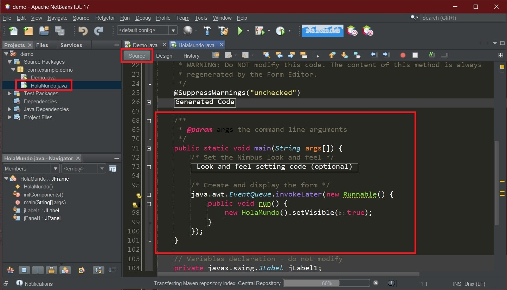

4. Para separar responsabilidades, eliminamos el método `main()` de las clases que extienden de `JFrame` y trasladamos la lógica de mostrar u ocultar ventanas a la clase principal, de manera que esta sea la única clase ejecutable:
   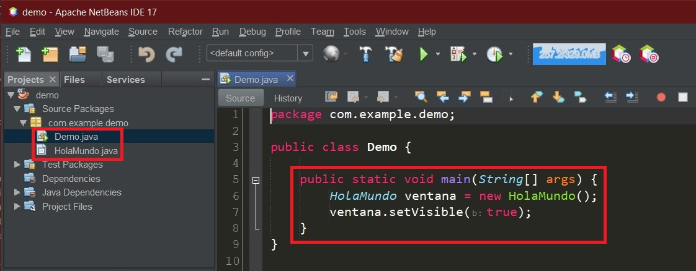

#### IntelliJ + GUI Designer

Para crear una vista en un nuevo proyecto usando el GUI Designer de IntelliJ IDEA:

1. Hacer click derecho en el paquete donde se va a crear la vista y seguir los pasos:

- New
- Swing GUI Designer
- GUI Form
  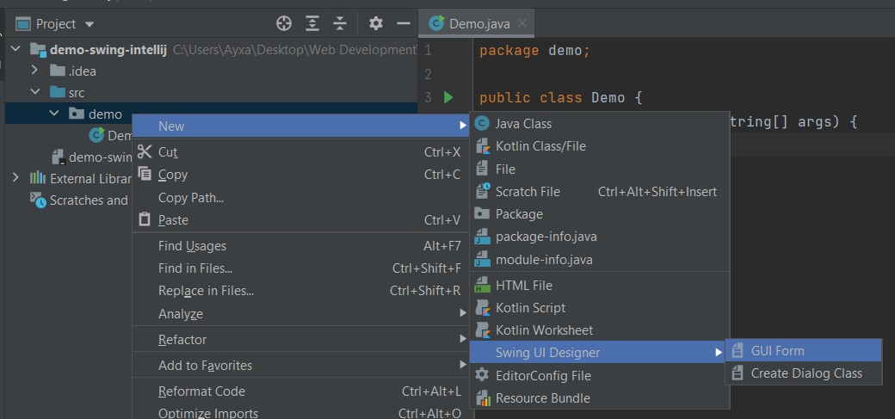

2. Ingresar los datos de la vista (nombre y tipo de layout)
   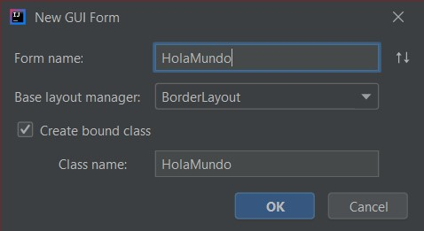

3. Automáticamente se generan un archivo `.form` y uno `.java` asociados a la nueva vista. Podemos arrastrar y soltar componentes de la paleta al panel.
   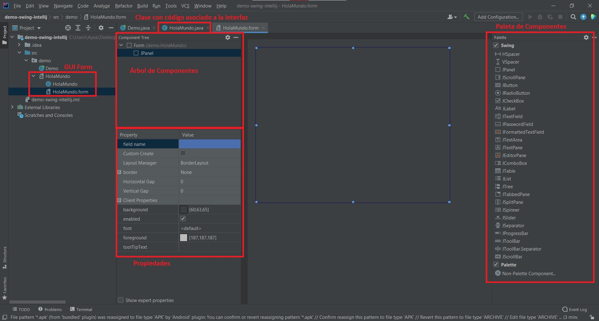
   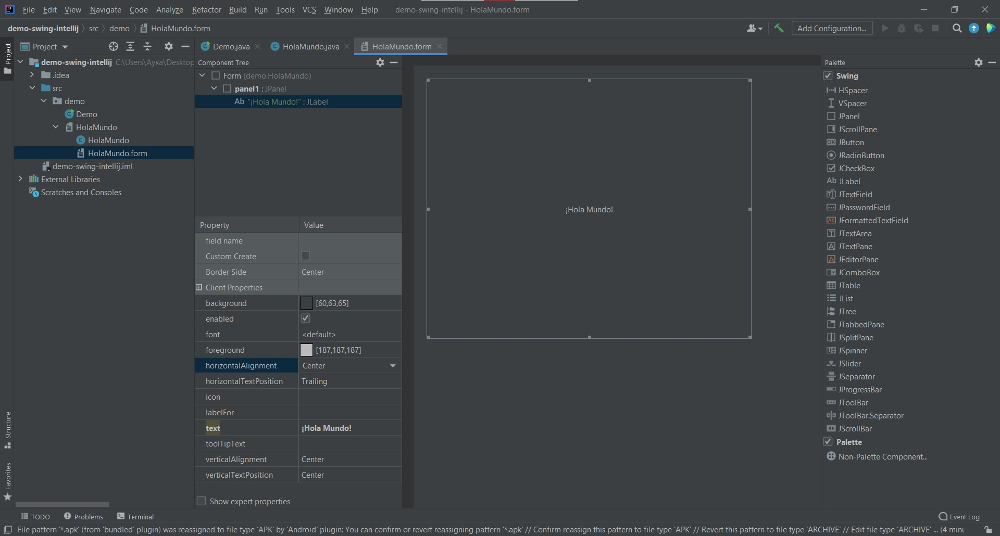

4. IntelliJ genera una clase asociada a la interfaz que incluye solamente los componentes de la vista. Es necesario agregar el resto del código de manera manual para vincular dicha vista a la aplicación:
   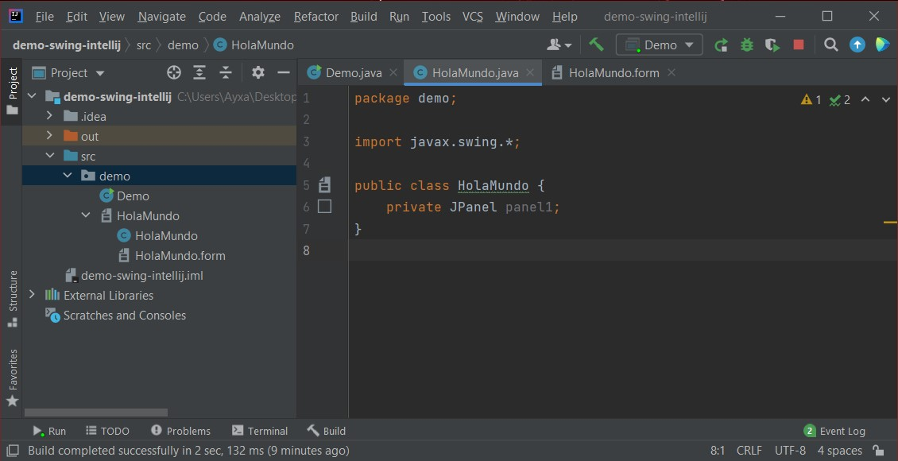

Es necesario agregar el resto del código de manera manual para vincular dicha vista a la aplicación:
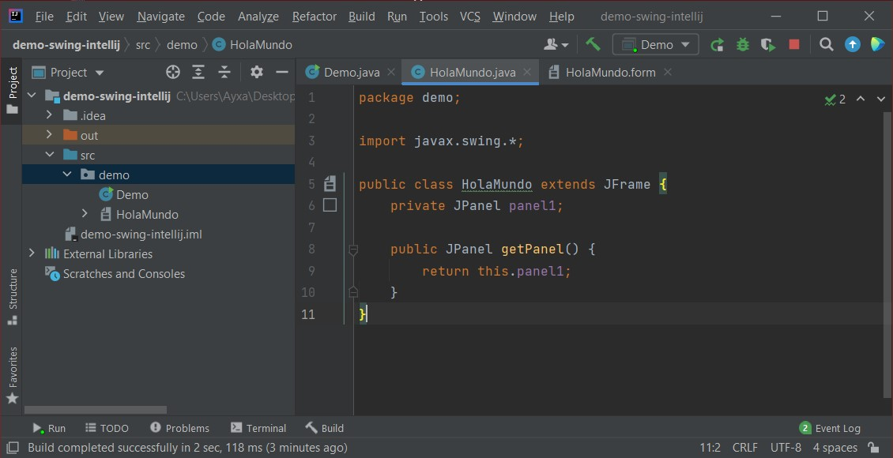

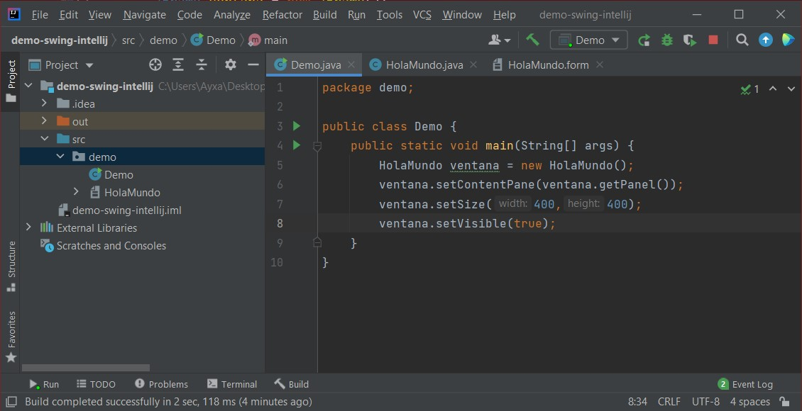

#### Visual Studio Code

Solo se necesita tener instalado el [Extension Pack for Java](https://marketplace.visualstudio.com/items?itemName=vscjava.vscode-java-pack)

### ¿Cómo exportar .jar ejecutable del proyecto?

#### Eclipse

#### Netbeans

#### IntelliJ

#### Visual Studio Code

### Proyecto

### Recursos Adicionales

[¿Qué es la biblioteca Swing?](https://www.aluracursos.com/blog/biblioteca-swing)
