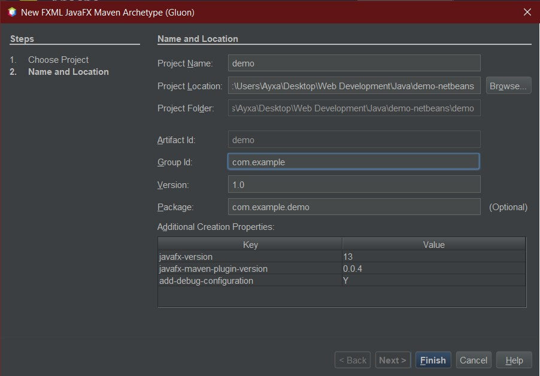

# Charlas de Backend

## Interfaces Gráficas en JavaFX

### Tabla de contenidos

- [¿Cómo empezar?](#¿cómo-empezar)
  - [Scene Builder](#scene-builder)
  - [Eclipse](#eclipse)
  - [Netbeans](#netbeans)
  - [IntelliJ](#intellij)
  - [Visual Studio Code](#visual-studio-code)
- [¿Cómo exportar como .jar ejecutable?](#¿cómo-exportar-jar-ejecutable-del-proyecto)
  - [Eclipse](#eclipse-1)
  - [Netbeans](#netbeans-1)
  - [IntelliJ](#intellij-1)
  - [Visual Studio Code](#visual-studio-code-1)
    - [Posibles errores y soluciones](#posibles-errores-y-soluciones)
- [Recursos Adicionales](#recursos-adicionales)

### ¿Cómo empezar?

#### Scene Builder

[Página de descargas del Scene Builder](https://gluonhq.com/products/scene-builder/)

#### Eclipse

1. Crear nuevo proyecto:

   

2. Escoger el tipo de proyecto "Maven Project" y hacer click en el botón `Next`:

   

3. Escoger la ubicación del proyecto y hacer click en el botón `Next`:

   

4. Esperar a que carguen los archetipos (Imagen de la esquina inferior izquierda de la ventana de Eclipse):

   

5. Seguir estos pasos:

- Filtrar por `fx`
- Escoger alguno de los dos últimos arquetipos de la lista de resultados:
- Hacer click en el botón `Next`:

  

6. Seguir estos pasos:

- Ingresar los siguientes parámetros del arquetipo:

  ```
  Group Id: org.openjfx
  // Para proyectos con FXML (Scene Builder)
  artifactId: javafx-archetype-fxml
  // Para proyectos sin FXML
  artifactId: javafx-archetype-simple
  ```

- Desmarcar la casilla "run archetype generation interactively"
- En la sección "Properties available from archetype", hacer doble click en los dos primeros valores de la columna "Value" casilla "run archetype generation interactively" y modificarlos así:

```
  javafx-version: 20
  javafx-maven-plugin-version: 0.0.8
```

- Hacer click en el botón `Finish`
  

Resultado:


#### Netbeans

1. Crear nuevo proyecto:

   

2. Seguir estos pasos:

- Escoger la categoría "Java with Maven"
- Escoger el tipo de proyecto "Project fr
- Hacer click en `Next`

  

3. Ingresar datos del proyecto y hacer click en `Finish`

   

Resultado:


#### IntelliJ

1. Crear nuevo proyecto:

- Desde la ventana de inicio:

  

- Desde la ventana principal:

  

2. Seguir los pasos:

- Escoger Maven
- Seleccionar Java 11 o superior
- Activar "Create from archetype"
- Hacer click en Add Archetype
- Llenar el formulario con los datos:
  ```
  groupId: org.openjfx
  artifactId: javafx-maven-archetypes
  version: 0.0.6
  ```
- Hacer click en el botón `OK` y luego en el de `Next`


3. Ingresar datos del proyecto de Maven (los de la imagen son a modo de ejemplo) y luego hacer click en `Next`.

   

4. Editar la propiedad `archetypeArtifactId`:

- En la sección "Properties", seleccionar la fila de nombre `archetypeArtifactId`
- Hacer click en el botón para editar

  

- Reemplazar el `Value` con alguna de estas opciones:

  ```
  // Para un proyecto que usa fxml (Scene Builder):
  javafx-archetype-fxml
  // Para un proyecto sin fxml:
  javafx-archetype-simple
  ```

  

5.  En la sección "Properties", hacer click en el botón para agregar.

    

6.  Ingresar los siguientes datos y hacer click en el botón `OK`:

```
name: javafx-version
value: 20
```


7. Hacer click en Finish y esperar a que se imprima `BUILD SUCCESS` en la terminal.

Resultado:


#### Visual Studio Code

1. Instalar el [Extension Pack for Java](https://marketplace.visualstudio.com/items?itemName=vscjava.vscode-java-pack)
2. Abrir la paleta de comandos en Visual Studio Code `(Ctrl+Shift+P)`, y luego escoger el comando de Java: "Create Java Project".

   

   

3. Ingresar los valores del groupId y artifactId del proyecto.

   

   

4. Escoger la carpeta en donde se creará el proyecto:

   

5. Esperar a que se solicite la versión del proyecto en la terminal e ingresar el valor:

   

6. Esperar a que se genere el resumen del proyecto e ingresar `Y` en la terminal para confirmar que todo está correcto:
   

7. Esperar el mensaje `BUILD SUCCESS` en la terminal.

Resultado:


##### Posibles errores y soluciones:

- **ERROR:** ERROR: JAVA_HOME is set to an invalid directory: `C:\Program Files\Java\jdk1.8.0* 131\bin`

  - **SOLUCIÓN:**
    1. Modificar el valor de `JAVA_HOME` en las variables de entorno y quitarle el `\bin` al final de la ruta (En el ejemplo quedaría como: `JAVA_HOME: C:\Program Files\Java\jdk1.8.0_ 131`).

- **ERROR:** Cannot resolve the modulepaths/classpaths automatically, please specify the value in the launch.json.
  - **SOLUCIÓN:**
    1. Abrir la paleta de comandos en Visual Studio Code `(Ctrl+Shift+P)`
    2. Escoger el comando de Java: "Clean Java Language Server Workspace"
    3. Ejecutar nuevamente

### ¿Cómo exportar .jar ejecutable del proyecto?

#### Eclipse

#### Netbeans

#### IntelliJ

[Exportar proyectos de JavaFX 11+ como archivos .jar ejecutables with IntelliJ (en inglés)](https://youtu.be/F8ahBtXkQzU)

#### Visual Studio Code

### Recursos Adicionales

[Documentación oficial de JavaFX (en inglés)](https://openjfx.io/openjfx-docs/#maven)

[Documentación sobre cómo desarrollar interfaces gráficas en Java en la página oficial de Visual Studio Code](https://code.visualstudio.com/docs/java/java-gui)
