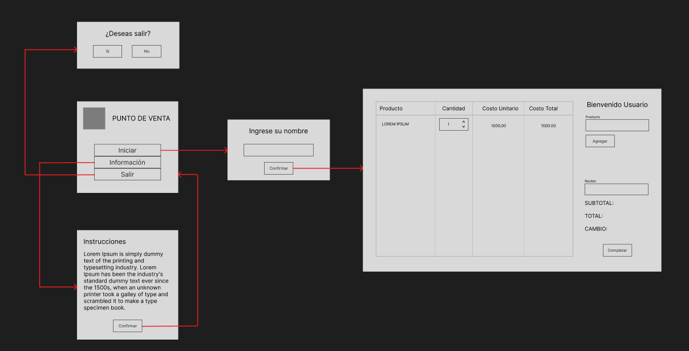

# Charlas de Backend

## Interfaces Gráficas en Java

### Tabla de contenidos

- [Java Swing](java-swing.md)
  - [¿Cómo empezar?](./java-swing.md#¿cómo-empezar)
  - [Eclipse + WindowBuilder](./java-swing.md#eclipse--windowbuilder)
  - [Netbeans](./java-swing.md#netbeans)
  - [IntelliJ + GUI Designer](./java-swing.md#intellij--gui-designer)
  - [Visual Studio Code](./java-swing.md#visual-studio-code)
  - [¿Cómo exportar como .jar ejecutable?](./java-swing.md#¿cómo-exportar-jar-ejecutable-del-proyecto)
    - [Eclipse](./java-swing.md#eclipse)
    - [Netbeans](./java-swing.md#netbeans-1)
    - [IntelliJ](./java-swing.md#intellij)
    - [Visual Studio Code](./java-swing.md#visual-studio-code-1)
  - [Recursos Adicionales](./java-swing.md#recursos-adicionales)
- [JavaFX](/javafx.md)
  - [¿Cómo empezar?](./javafx.md#¿cómo-empezar)
    - [Eclipse](./javafx.md#eclipse)
    - [Netbeans](./javafx.md#netbeans)
    - [IntelliJ](./javafx.md#intellij)
    - [Visual Studio Code](./javafx.md#visual-studio-code)
  - [¿Cómo exportar como .jar ejecutable?](./javafx.md#¿cómo-exportar-jar-ejecutable-del-proyecto)
    - [Eclipse](./javafx.md#eclipse-1)
    - [Netbeans](./javafx.md#netbeans-1)
    - [IntelliJ](./javafx.md#intellij-1)
    - [Visual Studio Code](./javafx.md#visual-studio-code-1)
  - [Recursos Adicionales](./javafx.md#recursos-adicionales)
- [Proyecto: Punto de Venta](#proyecto-punto-de-venta)
  - [Diagrama de flujo (Vistas)](#diagrama-de-flujo-vistas)
  - [Java Swing](#java-swing)
    - [Repositorio](#repositorio)
  - [JavaFX](#javafx)
- [Herramientas Visuales](#herramientas-visuales)
### Proyecto: Punto de Venta

#### Diagrama de flujo (Vistas)

#### Java Swing

##### Repositorio

[Repositorio del proyecto hecho en Java Swing](https://github.com/joshuaFrias95/sistema-de-ventas-G5)

#### JavaFX

#### Herramientas Visuales
- [Color Hunt](https://www.colorhunt.co/)
